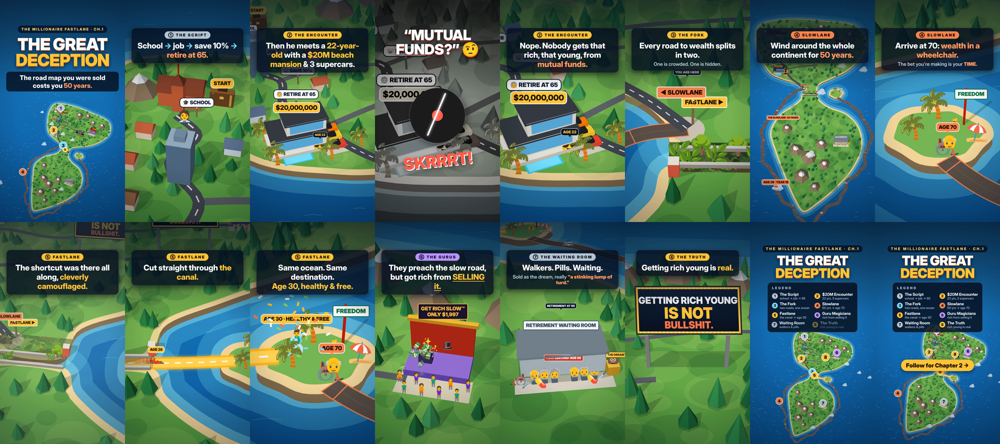

# The Great Deception: The Millionaire Fastlane, Chapter 1 (Instagram Reel)

A 64-second vertical reel (1080×1920, 30 fps) that turns Chapter 1 of *The Millionaire Fastlane* by MJ DeMarco into an animated 3D road map.

**Watch:** [`fastlane_ch1_reel.mp4`](fastlane_ch1_reel.mp4)



| # | Time | Landmark | What you see |
|---|---|---|---|
| | 0–4 s | Title | The whole map from above, with the title "The Great Deception" |
| 1 | 4–11 s | The Script | A school and a giant briefcase at START. A commuter walks past signposts: school → job → save 10% → retire at 65 |
| 2 | 11–20 s | The Encounter | A $20M beach mansion, a 22-year-old and 3 supercars. "Mutual funds?" triggers a record scratch: the frame shakes, turns grey and the music stops |
| 3 | 20–24 s | The Fork | Two signs. The Slowlane is crowded; the Fastlane leads into camouflage |
| 4 | 24–35 s | Slowlane | A car winds 50 years around the southern continent (an age/year counter runs 20 → 70) and arrives at the island as a wheelchair: **wealth in a wheelchair** |
| 5 | 35–44 s | Fastlane | The camouflage net slides off a canal through the isthmus. A supercar cuts through to the same island at **age 30, healthy & free** |
| 6 | 44–50 s | Guru Magicians | Top hats and wands on a stage while the crowd's cash flies to the guru: "rich from SELLING it" |
| 7 | 50–55 s | Waiting Room | Walkers, pills, a wheelchair, "Now serving: age 65" and "The Dream™" (a 💩 with flies) |
| 8 | 55–59 s | The Truth | A billboard: "Getting rich young is NOT bullshit." |
| | 59–64 s | Legend | Numbered pins over the full map, the title and a legend. The last frame returns to the opening shot so the reel loops |

## How it's made

- `reel.html` draws everything on a Canvas 2D context. Continents are smoothed polygons, roads are perspective ribbons, and landmarks are extruded low-poly shapes, painter-sorted and lit, with cast shadows and emoji sprites. The camera is a perspective rig tilted about 30° (pitch 42–66°), flown between keyframes. Captions are HTML, placed in the Reels safe zone. Open the file in a browser to watch it play live (`?t=30` starts 30 s in).
- `render.mjs` steps headless Chromium (Playwright) frame by frame and pipes PNGs to ffmpeg.
- `soundtrack.py` synthesizes the music and effects with numpy/scipy: a 97.5 BPM groove (26 bars, so it loops), a tape-stop and record scratch, a clock tick for each Slowlane year, a sad trombone, an engine zoom, ka-chings, and a muffled "waiting room" mix.
- `build_reel.sh` renders 4 chunks in parallel and muxes them with Instagram-friendly settings: H.264 High 4.1, BT.709, AAC 48 kHz, −14 LUFS, faststart.

```bash
pip install numpy scipy
npm i playwright           # uses the preinstalled Chromium
./build_reel.sh            # or: W=540 H=960 ./build_reel.sh for a quick preview
```
