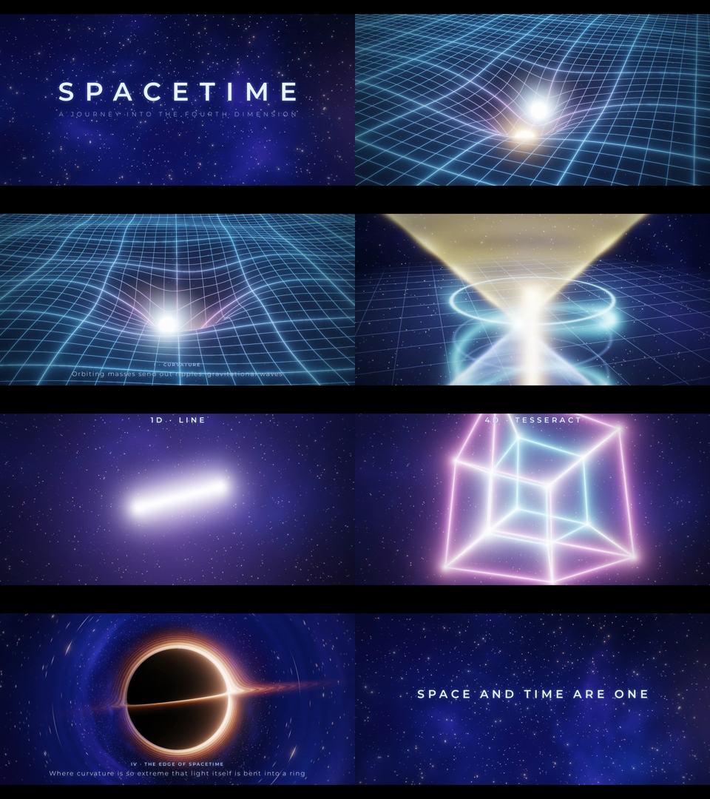

# SPACETIME: a short film about the fourth dimension

A 70-second, 1080p, 24 fps short film rendered entirely from GLSL shaders, with a synthesized ambient score.

**Watch:** [`spacetime.mp4`](spacetime.mp4)



| Chapter | Time | What you see |
|---|---|---|
| Title | 0–7 s | Deep starfield and nebula |
| I · Curvature | 7–23 s | A raymarched spacetime "fabric" warped by a binary star. The pair spirals inward, radiating spiral gravitational waves, and merges on a LIGO-style audio chirp. |
| II · Time as a dimension | 23–35 s | Space flattened to a plane with time as the vertical axis. A planet's orbit traces a helix worldline around the star's straight one, and future and past light cones open from its present event. |
| III · The fourth dimension | 35–50 s | Point → line → square → cube → tesseract, each made by extruding the previous shape into a new axis. The tesseract then rotates in the XW/YW/ZW planes, shown as its perspective projection into 3D. |
| IV · The edge of spacetime | 50–63 s | A Schwarzschild black hole, rendered by integrating bent light rays. It shows gravitational lensing, the photon ring, an accretion disk with Doppler beaming, and lensed background stars. |
| Outro | 63–70 s | "Space and time are one" |

## How it's made

- `index.html` holds all visuals: a WebGL2 scene shader (raymarching, heightfield marching and null-geodesic integration) and an HDR post-processing chain (5-level bloom, ACES tonemapping, chromatic aberration, vignette, film grain and 2.39:1 letterbox). Opened directly in a browser, it plays in real time.
- `render.mjs` drives headless Chromium through Playwright. It renders each frame at a fixed time and pipes the frames to ffmpeg (x264, CRF 16).
- `soundtrack.py` builds the score with numpy/scipy: drone, chord pads for each chapter, star shimmer, the inspiral chirp and merger boom, tesseract chimes, black-hole sub-rumble and convolution reverb.
- `build.sh` runs everything and muxes the final `spacetime.mp4`.

```bash
pip install numpy scipy imageio-ffmpeg
npm i playwright            # uses the preinstalled Chromium
./build.sh                  # or: W=1280 H=720 ./build.sh for a quick preview
```
